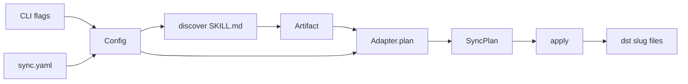

# Bare-bones `atb sync`

Repo is empty except [README.md](../../README.md). First cut is a Rust crate whose public types are the API, and whose only binary entry is `atb sync`.

## What the first cut does

Two equivalent ways to say the same job:

```
atb sync --config sync.yaml
atb sync --tool cursor --src ~/src/dotfiles/ai-coding --dst ~/.agents/skills
```

`--config` and the flag trio are two ways to build one `Config`. Flags override matching config fields when both are present. `sync` always discover → plan → apply (print the plan, then write).

Discovery walks `--src` for `**/SKILL.md`. That matches the real tree under `~/src/dotfiles/ai-coding/plugins/*/skills/<name>/SKILL.md`. A src of `.../ai-coding/skills` will find nothing today; the search root should be `ai-coding` (or `ai-coding/plugins`).

Each skill directory is copied as-is to `{dst}/{slug}/` (`SKILL.md`, `references/`, `LICENSE`, …). All four tools share that layout in v1. `--tool` is recorded on the `Target` so a later adapter can diverge; it does not change the copy today.



## Keep vs cut

**Keep (the pipeline still needs these):**

- `Tool` — closed enum: `claude`, `cursor`, `codex`, `opencode` (add variants later; no stringly `ToolId`, no `registerTool`)
- `Artifact` — one skill directory, not a kind union
- `Target` — `tool` + `output`
- `Config` — `source` + `targets[]` (flags synthesize a one-target config)
- `FileOp` — `Copy { from, to }` only
- `SyncPlan` — `target` + `ops`
- `Adapter` — `fn plan(&[Artifact], &Target) -> Vec<FileOp>`
- `discover` / `plan` / `apply` as functions (no `Engine` trait)

**Cut (redundant or unused by `atb sync`):**

| Spec item | Why it goes |
|---|---|
| `registerTool` / `ToolSpec` / open `ToolId` | Four tools, one layout; a match on `Tool` is enough |
| `ArtifactKind` (`rule`, `mcpServer`, `command`, `ignore`) | CLI is skills-only |
| `McpServerSpec` | No MCP command |
| `ArtifactMeta.targets/exclude/scope/globs/activation/order` | Not read; optional `name` / `description` from frontmatter only |
| `Source` wrapper | `PathBuf` + `Vec<Artifact>` is enough |
| `TargetConfig.merge` / `writeRegion` / `activation` / `options` | Skills are whole-dir copies, not AGENTS.md regions |
| Fidelity matrix + plan warnings | Every v1 op is a native copy |
| `Adapter.parse` / `importFrom` | No import command |
| `Manifest` / `check` / `clean` / `delete` ops | No drift or cleanup command yet |
| `kinds:` routing, `conflict`, `clean`, `scope` | No second kind and no lockfile |
| `generate` / `check` / `import` / `clean` CLI | One verb: `sync` |

## Rust types (the API)

Single crate, `edition = "2021"`. Package `agent-tool-box`, bin name `atb`.

```rust
#[derive(Clone, Copy, Debug, Eq, PartialEq, Hash)]
pub enum Tool { Claude, Cursor, Codex, OpenCode }

pub struct Artifact {
    pub id: String,              // directory name, e.g. "stop-slop"
    pub source_dir: PathBuf,     // folder that contains SKILL.md
    pub meta: ArtifactMeta,
}

pub struct ArtifactMeta {
    pub name: Option<String>,
    pub description: Option<String>,
}

pub struct Target {
    pub tool: Tool,
    pub output: PathBuf,         // --dst / targets.<tool>.output
}

pub struct Config {
    pub source: PathBuf,
    pub targets: Vec<Target>,
}

pub enum FileOp {
    Copy { from: PathBuf, to: PathBuf },
}

pub struct SyncPlan {
    pub target: Target,
    pub ops: Vec<FileOp>,
}

pub trait Adapter {
    fn plan(&self, artifacts: &[Artifact], target: &Target) -> Vec<FileOp>;
}

pub fn discover(source: &Path) -> Result<Vec<Artifact>>;
pub fn plan(artifacts: &[Artifact], targets: &[Target]) -> Vec<SyncPlan>;
pub fn apply(plans: &[SyncPlan]) -> Result<()>;
```

`SkillCopy` is the only adapter: for each artifact, emit a `Copy` for every file under `source_dir` to `output.join(id).join(relpath)`. `plan()` is a `Tool -> &dyn Adapter` match that currently returns that same adapter for every variant.

Config YAML (no `version`, `defaults`, `kinds`, `merge`):

```yaml
source: /Users/yliapis/src/dotfiles/ai-coding
targets:
  cursor:
    output: ~/.agents/skills
  claude:
    output: ~/.claude/skills
```

Tilde expansion on `source` and `output`. `serde` + `serde_yaml` for load; `clap` derive for the CLI.

## Crate layout

- [Cargo.toml](../../Cargo.toml) — deps: `clap` (derive), `serde`, `serde_yaml`, `walkdir`, `anyhow`. Frontmatter: split on the first `---` / `---` and parse the YAML block; no extra crate unless that proves painful.
- [src/lib.rs](../../src/lib.rs) — re-export the types and the three functions
- [src/model.rs](../../src/model.rs) — types above
- [src/config.rs](../../src/config.rs) — YAML + flag merge → `Config`
- [src/discover.rs](../../src/discover.rs) — `walkdir` for `SKILL.md`; `id` = parent dir name; skip hidden dirs
- [src/adapter.rs](../../src/adapter.rs) — `Adapter` + `SkillCopy`
- [src/apply.rs](../../src/apply.rs) — `create_dir_all` + `fs::copy`; overwrite
- [src/main.rs](../../src/main.rs) — `atb sync` only
- [README.md](../../README.md) — crate purpose + the two invocations

CLI shape:

```
atb sync --config <path>
atb sync --tool <claude|cursor|codex|opencode> --src <dir> --dst <dir>
```

`--config` may be omitted if the flag trio is complete. Require `--src` and `--dst` when not using `--config`. Print each `Copy` as `from -> to`, then apply. Exit non-zero on missing paths or unknown `--tool`.

## Tests (thin)

Fixture with two skill dirs (one with a `references/` file). Assert `discover` ids, assert plan destinations are `{dst}/{id}/SKILL.md`, assert `apply` writes both files. One config-parse test for the YAML above.

## Out of scope

Per-tool SKILL.md rewriting, `compatibility:` filtering, region markers, MCP/rules/commands, plugin registry, lockfile, dry-run flag, `check` / `import` / `clean`.
