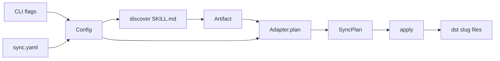

# `atb sync` — spec

Normative spec for the first cut of `agent-tool-box`: a Rust crate whose public types are the API, and whose only binary entry is `atb sync`. Iterate here; [the plan](../plans/bare-bones-atb-sync.md) tracks sequencing only.

## Behavior

Two equivalent ways to say the same job:

```
atb sync --config sync.yaml
atb sync --src ~/src/dotfiles/ai-coding/skills --dst ~/.agents/skills
```

`--config` and the `--src`/`--dst` pair are two ways to build one `Config`, and they are mutually exclusive (a clap `ArgGroup`). "Flags override config" sounds simple but is ill-defined the moment a config has two targets — which one does `--dst` override? — so v1 refuses the mix instead of defining merge semantics. `sync` always discover → plan → apply (print the plan, then write).



## Discovery

Walks `src` for `**/SKILL.md`; each match's parent directory is one skill, `id` = that directory's name. That matches the real tree under `~/src/dotfiles/ai-coding/plugins/*/skills/<name>/SKILL.md`. A src of `.../ai-coding/skills` will find nothing today; the search root should be `ai-coding` (or `ai-coding/plugins`).

- **Symlinks are followed** (`walkdir` with `follow_links(true)`; its built-in loop detection turns cycles into errors).
- **Nothing is skipped**: hidden files and directories are walked like everything else. Filtering is a later option (see TODO).
- Discovery errors (exit non-zero, nothing written):
  - zero skills found — the message carries the search-root hint above
  - duplicate skill ids (same directory name under two plugins) — both would land at `{dst}/{slug}/`, and last-write-wins would hide the collision
  - a `SKILL.md` nested beneath an already-matched skill dir (see TODO — nested skills may deserve a further look)

## Copy semantics

Each skill directory is copied as-is to `{dst}/{slug}/` — every file (`SKILL.md`, `references/`, `LICENSE`, junk like `.DS_Store` included; filters are TODO). Symlinked files are materialized: `fs::copy` follows the link and writes the target's content. Overwrite existing files; never delete — stale files in `dst` are the future `clean`'s problem.

All four tools share this layout in v1. The copy does not depend on which tool the dst belongs to; `--tool` is deferred until an adapter actually diverges (see TODO).

## Apply

Print each `Copy` as `from -> to`, then write with `create_dir_all` + `fs::copy`. **Abort on the first failed op**: exit non-zero; files already written stay. (Flag-controlled abort/continue is TODO.)

## Config

# TODO: UPDATE THIS MORE CAREFULLY
```yaml
source: /Users/yliapis/src/dotfiles/ai-coding/skills
targets:
  cursor:
    output: ~/.agents/skills
  claude:
    output: ~/.claude/skills
```

No `version`, `defaults`, `kinds`, `merge`. Tilde expansion on `source` and `output`: a manual `~/` prefix swap using `std::env::home_dir()` (un-deprecated since Rust 1.87) — no `shellexpand` dep.

**Validation is strict — every problem is an error**, not a warning: unknown YAML fields (`deny_unknown_fields`), a typo'd target key (anything not a `Tool` variant name), and an empty or missing `targets:`.

## Platform

Unix only for v1: macOS, Linux, BSDs. Windows is unsupported and `atb` makes no attempt at non-Unix path handling.

## CLI

```
atb sync --config <path>
atb sync --src <dir> --dst <dir>
```

Exactly one of `--config` or the `--src`/`--dst` pair; both flags are required when `--config` is absent. Exit non-zero on: mixing `--config` with the pair, missing paths, invalid config, zero skills discovered, duplicate skill ids, nested `SKILL.md`, or a failed copy.

## Rust API

Single crate, `edition = "2024"`. Package `agent-tool-box`, bin name `atb`. `Result` is `anyhow::Result` throughout — no custom error enum in v1.

```rust
#[derive(Clone, Copy, Debug, Eq, PartialEq, Hash)]
pub enum Tool { Claude, Cursor, Codex, OpenCode }

pub struct Artifact {
    pub id: String,              // directory name, e.g. "stop-slop"
    pub source_dir: PathBuf,     // folder that contains SKILL.md
    pub meta: ArtifactMeta,
}

pub struct ArtifactMeta {
    pub name: Option<String>,
    pub description: Option<String>,
}

pub struct Target {
    pub tool: Option<Tool>,      // YAML target key; None on the flag path
    pub output: PathBuf,         // --dst / targets.<tool>.output
}

pub struct Config {
    pub source: PathBuf,
    pub targets: Vec<Target>,
}

pub enum FileOp {
    Copy { from: PathBuf, to: PathBuf },
}

pub struct SyncPlan {
    pub target: Target,
    pub ops: Vec<FileOp>,
}

pub trait Adapter {
    fn plan(&self, artifacts: &[Artifact], target: &Target) -> Vec<FileOp>;
}

pub fn discover(source: &Path) -> Result<Vec<Artifact>>;
pub fn plan(artifacts: &[Artifact], targets: &[Target]) -> Vec<SyncPlan>;
pub fn apply(plans: &[SyncPlan]) -> Result<()>;
```

`SkillCopy` is the only adapter: for each artifact, emit a `Copy` for every file under `source_dir` to `output.join(id).join(relpath)`. `plan()` picks `SkillCopy` for every target; `tool` is unused until an adapter diverges.

Frontmatter: split `SKILL.md` on the first `---` / `---` pair and parse the YAML block; missing or malformed frontmatter is fine — `meta` fields just stay `None`. No extra crate unless that proves painful.

## Crate layout

- `Cargo.toml` — deps: `clap` (derive), `serde`, `serde_yaml_ng` (`serde_yaml` is archived; this is the API-compatible fork), `walkdir`, `anyhow`
- `src/main.rs` — `atb sync` only
- `src/lib.rs` — re-export the types and the three functions
- `src/model.rs` — types above
- `src/config.rs` — YAML or `--src`/`--dst` → `Config`
- `src/discover.rs` — `walkdir` for `SKILL.md`
- `src/adapter.rs` — `Adapter` + `SkillCopy`
- `src/apply.rs` — `create_dir_all` + `fs::copy`

## Tests (thin)

Fixture with two skill dirs (one with a `references/` file). Assert `discover` ids, assert plan destinations are `{dst}/{id}/SKILL.md`, assert `apply` writes both files. One config-parse test for the YAML above. Error-path tests: a src with no `SKILL.md` fails with the search-root hint, duplicate skill ids fail, nested `SKILL.md` fails, an unknown config field fails.

## TODO (considered, not committed)

- **`--tool`** — all four tools share one copy layout, so the flag only labeled the `Target`. Cut for now; bring back when an adapter diverges. Config YAML still keys targets by `Tool` name.
- **`--dry-run`** — `sync` overwrites files under `~/.claude` / `~/.agents` with no preview mode, and the flag itself is one `if` before `apply`. Cut for now; needs more thought (interaction with a future `check` / `clean`, what "preview" means once ops aren't all copies).
- **Discovery/copy filters** — v1 skips nothing; an include/exclude option (globs) would let junk (`.DS_Store`) and private files be excluded.
- **Apply-behavior flags** — v1 aborts on first failure; a flag could select best-effort-with-summary instead.
- **Nested skills** — nested `SKILL.md` is an error today; take a further look at whether it should be legal (and what `id`/layout it would map to).

## Cut from v1 (rationale)

| Item | Why it goes |
|---|---|
| `registerTool` / `ToolSpec` / open `ToolId` | Four tools, one layout; a match on `Tool` is enough |
| `ArtifactKind` (`rule`, `mcpServer`, `command`, `ignore`) | CLI is skills-only |
| `McpServerSpec` | No MCP command |
| `ArtifactMeta.targets/exclude/scope/globs/activation/order` | Not read; optional `name` / `description` from frontmatter only |
| `Source` wrapper | `PathBuf` + `Vec<Artifact>` is enough |
| `TargetConfig.merge` / `writeRegion` / `activation` / `options` | Skills are whole-dir copies, not AGENTS.md regions |
| Fidelity matrix + plan warnings | Every v1 op is a native copy |
| `Adapter.parse` / `importFrom` | No import command |
| `Manifest` / `check` / `clean` / `delete` ops | No drift or cleanup command yet |
| `kinds:` routing, `conflict`, `clean`, `scope` | No second kind and no lockfile |
| `generate` / `check` / `import` / `clean` CLI | One verb: `sync` |

## Out of scope

Per-tool SKILL.md rewriting, `compatibility:` filtering, region markers, MCP/rules/commands, plugin registry, lockfile, flag-over-config merge semantics, deleting stale files from `dst`, Windows, `check` / `import` / `clean`.
