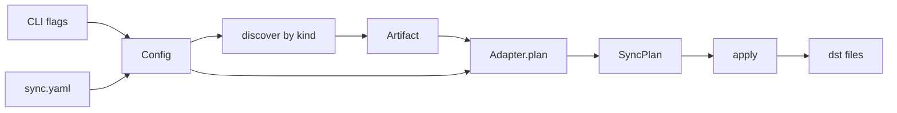

# `atb sync` — spec

Normative spec for the first cut of `agent-tool-box`: a Rust crate whose public types are the API, and whose only binary entry is `atb sync`. Iterate here; [the plan](../plans/bare-bones-atb-sync.md) tracks sequencing only. YAML `--config` is a later feature; its design lives in [config-spec.md](config-spec.md).

## Behavior

Two equivalent ways to say the same job:

```
atb sync --config sync.yaml
atb sync --src ~/src/dotfiles/ai-coding --dst ~/.cursor/skills
```

`--config` and the `--src`/`--dst` pair are two ways to build one `Config`, and they are mutually exclusive (a clap `ArgGroup`). `--kind` is legal only with the pair; default `skill`. "Flags override config" sounds simple but is ill-defined the moment a config has two targets — which one does `--dst` override? — so v1 refuses the mix instead of defining merge semantics. `sync` always discover → plan → apply (print the plan, then write).

`--config` is a TODO feature: the flag is optional and exits non-zero when present. YAML schema lives in [config-spec.md](config-spec.md).



## Discovery

Walks `src` by `Kind`. That matches the real tree under `~/src/dotfiles/ai-coding/plugins/*/{skills,commands,agents}/…`. The search root should be `ai-coding` (or `ai-coding/plugins`), not `ai-coding/skills`.

| `Kind` | Match under `src` | `id` | `source` |
|---|---|---|---|
| `Skill` | `**/skills/*/SKILL.md` | parent directory name | that directory |
| `Command` | `**/commands/*.md` (direct children) | filename (`critique.md`) | that file |
| `Agent` | `**/agents/*.md` (direct children) | filename | that file |

A file in `commands/foo/bar.md` is not a command. Do not error; do not copy it.

- **Symlinks are followed** (`walkdir` with `follow_links(true)`; its built-in loop detection turns cycles into errors).
- **Nothing is skipped**: hidden files and directories are walked like everything else. Filtering is a later option (see TODO).
- Discovery errors (exit non-zero, nothing written), keyed by kind:
  - zero matches — the message names the marker and the search-root hint (`ai-coding` or `ai-coding/plugins`, not `ai-coding/skills`)
  - duplicate `id` in the discovered set (same name under two plugins) — both would land at the same dest path, and last-write-wins would hide the collision
  - `Skill` only: a `SKILL.md` nested beneath an already-matched skill dir (see TODO — nested skills may deserve a further look)

## Copy semantics

`CopyAdapter` has two layouts:

- `Skill` — every file under `source` → `{output}/{id}/{relpath}` (same as today, including junk like `.DS_Store`; filters are TODO)
- `Command` / `Agent` — one `Copy` of `source` → `{output}/{id}`

Symlinked files are materialized: `fs::copy` follows the link and writes the target's content. Overwrite existing files; never delete — stale files in `dst` are the future `clean`'s problem.

All four tools share this layout in v1. The copy does not depend on which tool the dst belongs to; `--tool` is deferred until an adapter actually diverges (see TODO).

## Apply

Print each `Copy` as `from -> to`, then write with `create_dir_all` + `fs::copy`. **Abort on the first failed op**: exit non-zero; files already written stay. (Flag-controlled abort/continue is TODO.)

## Config

`--config` is a TODO feature. The flag is optional; when present, `atb sync` exits non-zero and writes nothing. Schema, validation, and the YAML → `Config` path are specified in [config-spec.md](config-spec.md).

## Platform

Unix only for v1: macOS, Linux, BSDs. Windows is unsupported and `atb` makes no attempt at non-Unix path handling.

## CLI

```
atb sync --config <path>
atb sync --src <dir> --dst <dir> [--kind skill|command|agent]
```

Exactly one of `--config` or the `--src`/`--dst` pair; both flags are required when `--config` is absent. `--kind` is legal only with the pair (same ArgGroup); default `skill`. Until `--config` lands, the flag is optional and fails when present. Exit non-zero on: `--config` present, mixing `--config` with the pair, missing paths, invalid config, zero matches, duplicate ids, nested `SKILL.md` (Skill only), or a failed copy.

## Rust API

Single crate, `edition = "2024"`. Package `agent-tool-box`, bin name `atb`. `Result` is `anyhow::Result` throughout — no custom error enum in v1.

```rust
#[derive(Clone, Copy, Debug, Eq, PartialEq, Hash)]
pub enum Tool { Claude, Cursor, Codex, OpenCode }

#[derive(Clone, Copy, Debug, Eq, PartialEq, Hash)]
pub enum Kind { Skill, Command, Agent }

pub struct Artifact {
    pub kind: Kind,
    pub id: String,        // dest name under output
    pub source: PathBuf,   // skill dir, or the command/agent file
    pub meta: ArtifactMeta,
}

pub struct ArtifactMeta {
    pub name: Option<String>,
    pub description: Option<String>,
}

pub struct Target {
    pub tool: Option<Tool>,      // YAML target key when config lands; None on the flag path
    pub output: PathBuf,         // --dst / targets.<tool>.output
}

pub struct Config {
    pub kind: Kind,              // default Skill
    pub source: PathBuf,
    pub targets: Vec<Target>,
}

pub enum FileOp {
    Copy { from: PathBuf, to: PathBuf },
}

pub struct SyncPlan {
    pub target: Target,
    pub ops: Vec<FileOp>,
}

pub trait Adapter {
    fn plan(&self, artifacts: &[Artifact], target: &Target) -> Vec<FileOp>;
}

pub fn discover(source: &Path, kind: Kind) -> Result<Vec<Artifact>>;
pub fn plan(artifacts: &[Artifact], targets: &[Target]) -> Vec<SyncPlan>;
pub fn apply(plans: &[SyncPlan]) -> Result<()>;
```

`CopyAdapter` is the only adapter: `Skill` emits a `Copy` for every file under `source` to `output.join(id).join(relpath)`; `Command` / `Agent` emit one `Copy` of `source` to `output.join(id)`. `plan()` picks `CopyAdapter` for every target; `tool` is unused until an adapter diverges.

Frontmatter: split the primary file (`source.join("SKILL.md")` for `Skill`, `source` itself for Command/Agent) on the first `---` / `---` pair and parse the YAML block; missing or malformed frontmatter is fine — `meta` fields just stay `None`. No extra crate unless that proves painful.

## Crate layout

- `Cargo.toml` — deps: `clap` (derive), `walkdir`, `anyhow`
- `src/main.rs` — `atb sync` only
- `src/lib.rs` — re-export the types and the three functions
- `src/model.rs` — types above
- `src/config.rs` — `--src`/`--dst` [`--kind`] → `Config` (YAML load is TODO; see [config-spec](config-spec.md))
- `src/discover.rs` — `walkdir` by kind
- `src/adapter.rs` — `Adapter` + `CopyAdapter`
- `src/apply.rs` — `create_dir_all` + `fs::copy`

## Tests (thin)

Fixture with two skill dirs (one with a `references/` file). Assert `discover` ids, assert plan destinations are `{dst}/{id}/SKILL.md`, assert `apply` writes both files. One command fixture (`commands/critique.md`) that asserts `discover` ids and a plan dest of `{dst}/critique.md`. Error-path tests: a src with no matches fails with the marker/search-root hint, duplicate ids fail, nested `SKILL.md` fails (Skill), `--config` present fails.

## TODO (considered, not committed)

- **`--config`** — YAML → `Config` for multi-target sync. Flag is wired and fails when present. Design: [config-spec.md](config-spec.md).
- **`--tool`** — all four tools share one copy layout, so the flag only labeled the `Target`. Cut for now; bring back when an adapter diverges.
- **`--dry-run`** — `sync` overwrites files under `~/.claude` / `~/.agents` with no preview mode, and the flag itself is one `if` before `apply`. Cut for now; needs more thought (interaction with a future `check` / `clean`, what "preview" means once ops aren't all copies).
- **Discovery/copy filters** — v1 skips nothing; an include/exclude option (globs) would let junk (`.DS_Store`) and private files be excluded.
- **Apply-behavior flags** — v1 aborts on first failure; a flag could select best-effort-with-summary instead.
- **Nested skills** — nested `SKILL.md` is an error today; take a further look at whether it should be legal (and what `id`/layout it would map to).
- **MarketplaceCopy** — Cursor `plugins/local/…` vs Claude `plugins/marketplaces/…` vs OpenCode none. Hooks stay off `Kind` (Claude-only dest, source is `ai-coding/hooks/`, not a plugin flatten).

## Cut from v1 (rationale)

| Item | Why it goes |
|---|---|
| `registerTool` / `ToolSpec` / open `ToolId` | Four tools, one layout; a match on `Tool` is enough |
| Wide `ArtifactKind` (`rule`, `mcpServer`, `ignore`) | Those are merge/region jobs, not flatten-copy |
| `McpServerSpec` | JSON merge, not `fs::copy` |
| Plugin / marketplace adapter | Different grain and per-tool dest; later `Adapter` |
| `ArtifactMeta.targets/exclude/scope/globs/activation/order` | Not read; optional `name` / `description` from frontmatter only |
| `Source` wrapper | `PathBuf` + `Vec<Artifact>` is enough |
| `TargetConfig.merge` / `writeRegion` / `activation` / `options` | Skills are whole-dir copies, not AGENTS.md regions |
| Fidelity matrix + plan warnings | Every v1 op is a native copy |
| `Adapter.parse` / `importFrom` | No import command |
| `Manifest` / `check` / `clean` / `delete` ops | No drift or cleanup command yet |
| `generate` / `check` / `import` / `clean` CLI | One verb: `sync` |

## Out of scope

Per-tool SKILL.md rewriting, `compatibility:` filtering, region markers, MCP, rules, plugin marketplace sync, lockfile, flag-over-config merge semantics, deleting stale files from `dst`, Windows, `check` / `import` / `clean`. YAML schema for `--config` is specified separately in [config-spec.md](config-spec.md).
