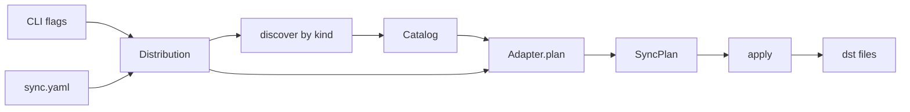

# `atb sync` — spec

Normative spec for the first cut of `agent-tool-box`. The public types of the Rust crate are the API. The only binary entry is `atb sync`. Iterate here. YAML `--config` is a later feature. Its design lives in [config-spec.md](config-spec.md).

## Behavior

Two surfaces build one [Distribution](domain-model.md#distribution):

```
atb sync --config sync.yaml
atb sync --src ~/src/dotfiles/ai-coding --dst ~/.cursor/skills
```

`--config` and the `--src` / `--dst` pair are mutually exclusive (a clap `ArgGroup`). `--kind` is legal only with the pair. Default `skill`. A mix of flags and config has no defined meaning. A config can have two targets. Then `--dst` has no single target to replace. v1 rejects the mix.

`sync` always runs discover, then plan, then apply. It prints the plan. Then it writes.

`--config` is a TODO feature. The flag is optional. When the flag is present, the command exits non-zero and writes nothing. The YAML schema lives in [config-spec.md](config-spec.md).



## Discovery

Discovery walks `root` by `Kind`. That walk matches the tree under `~/src/dotfiles/ai-coding/plugins/*/{skills,commands,agents}/…`. The root is `ai-coding` or `ai-coding/plugins`. The root is not `ai-coding/skills`.

What each `Kind` matches, and the `id` / `source` it yields, are the marker, referent, and id rows of the [layout convention](domain-model.md#layout-convention).

A file at `commands/foo/bar.md` is not a command. Discovery does not report an error. Discovery does not copy that file.

- **Symlinks are followed** (`walkdir` with `follow_links(true)`). Built-in loop detection turns cycles into errors.
- **Nothing is skipped.** Hidden files and directories are walked like everything else. Filtering is a later option (see TODO).
- Discovery errors (exit non-zero, nothing written), keyed by kind:
  - zero matches — the message names the marker and the search-root hint (`ai-coding` or `ai-coding/plugins`, not `ai-coding/skills`)
  - duplicate `id` in the Catalog (same name under two plugins) — both land at the same dest path, and last-write-wins hides the collision
  - `Skill` only: a `SKILL.md` nested beneath an already-matched skill dir (see TODO)

## Copy semantics

`CopyAdapter` expands each artifact by [`Kind`](domain-model.md#kind). Every file under a skill `source` goes to `{output}/{id}/{relpath}` (same as today, including junk like `.DS_Store`). Filters are TODO. A command or agent is one `Copy`.

Symlinked files are materialized: `fs::copy` follows the link and writes the target content. Overwrite existing files. Never delete. Stale files in `dst` are the future `clean` problem.

All four Tools share this layout in v1. The copy does not depend on which Tool the dst belongs to. `--tool` waits until an adapter diverges (see TODO).

## Apply

Print each `Copy` as `from -> to`. Then write with `create_dir_all` + `fs::copy`. **Abort on the first failed op**: exit non-zero. Files already written stay. (Flag-controlled abort/continue is TODO.)

## YAML config

`--config` is a TODO feature. The flag is optional. When the flag is present, `atb sync` exits non-zero and writes nothing. Schema, validation, and the YAML → `Distribution` path are specified in [config-spec.md](config-spec.md).

## Platform

Unix only for v1: macOS, Linux, BSDs. Windows is unsupported. `atb` does not handle non-Unix paths.

## CLI

```
atb sync --config <path>
atb sync --src <dir> --dst <dir> [--kind skill|command|agent]
```

Exactly one of `--config` or the `--src` / `--dst` pair. When `--config` is absent, both flags are required. `--kind` is legal only with the pair (same ArgGroup). Default `skill`. Until `--config` lands, the flag is optional. If the flag is present, the command fails. Exit non-zero on: `--config` present, mixing `--config` with the pair, missing paths, invalid config, zero matches, duplicate ids, nested `SKILL.md` (Skill only), or a failed copy.

## Rust API

Single crate, `edition = "2024"`. Package `agent-tool-box`, bin name `atb`. `Result` is `anyhow::Result` throughout. No custom error enum in v1. `Tool`, `Kind`, `Artifact`, `ArtifactMeta`, `Catalog`, `Target`, and `Distribution` are the Rust binding of the [domain model](domain-model.md). Fields, constraints, and relationships are defined there once. This block has no field comments (see [normativity](domain-model.md#normativity)). `FileOp`, `SyncPlan`, and `Adapter` are mechanics ([why](domain-model.md#deliberately-not-modeled)).

```rust
#[derive(Clone, Copy, Debug, Eq, PartialEq, Hash)]
pub enum Tool { Claude, Cursor, Codex, OpenCode }

#[derive(Clone, Copy, Debug, Eq, PartialEq, Hash)]
pub enum Kind { Skill, Command, Agent }

pub struct Artifact {
    pub kind: Kind,
    pub id: String,
    pub source: PathBuf,
    pub meta: ArtifactMeta,
}

pub struct ArtifactMeta {
    pub name: Option<String>,
    pub description: Option<String>,
}

pub struct Catalog {
    pub kind: Kind,
    pub root: PathBuf,
    pub artifacts: Vec<Artifact>,
}

pub struct Target {
    pub tool: Option<Tool>,
    pub output: PathBuf,
}

pub struct Distribution {
    pub kind: Kind,
    pub root: PathBuf,
    pub targets: Vec<Target>,
}

pub enum FileOp {
    Copy { from: PathBuf, to: PathBuf },
}

pub struct SyncPlan {
    pub target: Target,
    pub ops: Vec<FileOp>,
}

pub trait Adapter {
    fn plan(&self, artifacts: &[Artifact], target: &Target) -> Vec<FileOp>;
}

pub fn discover(root: &Path, kind: Kind) -> Result<Catalog>;
pub fn plan(catalog: &Catalog, targets: &[Target]) -> Vec<SyncPlan>;
pub fn apply(plans: &[SyncPlan]) -> Result<()>;
```

`CopyAdapter` is the only adapter. It emits the ops for each artifact (see [Copy semantics](#copy-semantics)). `plan()` picks `CopyAdapter` for every target. `tool` is unused until an adapter diverges.

Frontmatter: split the primary file (`source.join("SKILL.md")` for `Skill`, `source` itself for Command/Agent) on the first `---` / `---` pair and parse the YAML block. Missing or malformed frontmatter is fine. `meta` fields stay `None`. No extra crate unless that proves painful.

## Crate layout

- `Cargo.toml` — deps: `clap` (derive), `walkdir`, `anyhow`
- `src/main.rs` — `atb sync` only
- `src/lib.rs` — re-export the types and the three functions
- `src/model.rs` — types above
- `src/config.rs` — `--src` / `--dst` [`--kind`] → `Distribution` (YAML load is TODO; see [config-spec](config-spec.md))
- `src/discover.rs` — `walkdir` by kind
- `src/adapter.rs` — `Adapter` + `CopyAdapter`
- `src/apply.rs` — `create_dir_all` + `fs::copy`

## Tests (thin)

Fixture with two skill dirs (one with a `references/` file). Assert `discover` ids, assert plan destinations are `{dst}/{id}/SKILL.md`, assert `apply` writes both files. One command fixture (`commands/critique.md`) that asserts `discover` ids and a plan dest of `{dst}/critique.md`. Error-path tests: a root with no matches fails with the marker/search-root hint, duplicate ids fail, nested `SKILL.md` fails (Skill), `--config` present fails.

## TODO (considered, not committed)

- **`--config`** — YAML → `Distribution` for multi-target sync. Flag is wired and fails when present. Design: [config-spec.md](config-spec.md).
- **`--tool`** — all four Tools share one copy layout, so the flag only labeled the `Target`. Cut for now; bring back when an adapter diverges.
- **`--dry-run`** — `sync` overwrites files under `~/.claude` / `~/.agents` with no preview mode, and the flag itself is one `if` before `apply`. Cut for now; needs more thought (interaction with a future `check` / `clean`, what "preview" means once ops aren't all copies).
- **Discovery/copy filters** — v1 skips nothing. An include/exclude option (globs) can exclude junk (`.DS_Store`) and private files.
- **Apply-behavior flags** — v1 aborts on first failure. A later flag can select best-effort-with-summary instead.
- **Nested skills** — nested `SKILL.md` is an error today. Take a further look at whether it is legal, and what `id`/layout it maps to.
- **MarketplaceCopy** — Cursor `plugins/local/…` vs Claude `plugins/marketplaces/…` vs OpenCode none. Hooks stay off `Kind` (Claude-only dest, source is `ai-coding/hooks/`, not a plugin flatten).

## Cut from v1 (rationale)

| Item | Why it goes |
|---|---|
| `registerTool` / `ToolSpec` / open `ToolId` | Four Tools, one layout; a match on `Tool` is enough |
| Wide `ArtifactKind` (`rule`, `mcpServer`, `ignore`) | Those are merge/region jobs, not flatten-copy |
| `McpServerSpec` | JSON merge, not `fs::copy` |
| Plugin / marketplace adapter | Different grain and per-tool dest; later `Adapter` |
| `ArtifactMeta.targets/exclude/scope/globs/activation/order` | Not read; optional `name` / `description` from frontmatter only |
| `Source` wrapper | `Catalog` is enough |
| `TargetConfig.merge` / `writeRegion` / `activation` / `options` | Skills are whole-dir copies, not AGENTS.md regions |
| Fidelity matrix + plan warnings | Every v1 op is a native copy |
| `Adapter.parse` / `importFrom` | No import command |
| `Manifest` / `check` / `clean` / `delete` ops | No drift or cleanup command yet |
| `generate` / `check` / `import` / `clean` CLI | One verb: `sync` |

## Out of scope

Per-tool SKILL.md rewriting, `compatibility:` filtering, region markers, MCP, rules, plugin marketplace sync, lockfile, flag-over-config merge semantics, deleting stale files from `dst`, Windows, `check` / `import` / `clean`. YAML schema for `--config` is specified separately in [config-spec.md](config-spec.md).
