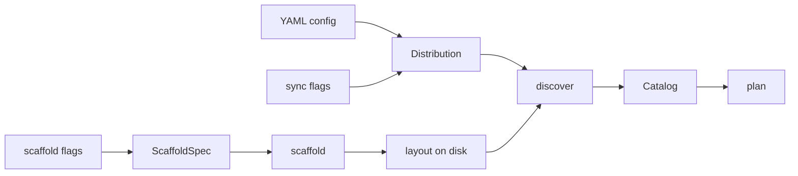
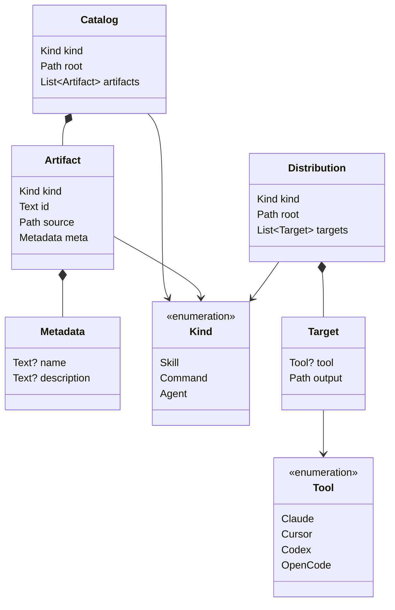

# Domain model

An **artifact** is a skill, a command, or an agent. You author it once in a source tree. Then you distribute it to the Tools that read it (Claude, Cursor, Codex, OpenCode).

This file is the source of truth for those nouns. The verb specs ([`atb sync`](atb-sync.md), [`atb sync --config`](config-spec.md), [`atb scaffold`](atb-scaffold.md)) bind the same types in Rust. A second binding (a JSON schema, another language) must agree with this file.

## Core and support

| Role | What | Why |
|---|---|---|
| **Core** | Artifact identity, the [layout convention](#layout-convention), the [round-trip law](#the-round-trip-law) | Scaffold and sync agree on what an artifact is on disk. |
| **Support** | [Distribution](#distribution) (sync), authoring ([scaffold](atb-scaffold.md)) | Necessary work around the core. |
| **Generic** | Filesystem copy, YAML parse, CLI parse | Use existing crates. Do not model them here. |

## Contexts

**Scaffold** and **Sync** are separate. They do not share objects at run time. They share the [layout convention](#layout-convention) on disk. That contract is the [round-trip law](#the-round-trip-law). Domain events are not part of v1.

Each input surface builds a domain value. The surface shape stops at that step.

| Surface | Builds | Notes |
|---|---|---|
| Sync flags (`--src`, `--dst`, `--kind`) | [Distribution](#distribution) | One Target. `tool` is empty in v1. |
| YAML config (`--config`) | [Distribution](#distribution) | Each target key is a Tool. See [config-spec](config-spec.md). |
| Scaffold flags | `ScaffoldSpec` | Command input, not a domain noun. |
| Artifact frontmatter | [Metadata](#metadata) | Missing or bad YAML is not an error. |
| Tool directories | files on disk | v1 uses one copy layout for every Tool. |

## Scope

Modeled here: nouns and the rules that belong to them. Fields, types, identity, invariants, and the layout convention.

Not modeled here: execution plans, filesystem operations, command input records, the discovery walk, validation order, and the CLI grammar. Those live in the verb specs. See [Deliberately not modeled](#deliberately-not-modeled).

## Normativity

One owner per fact.

- **Domain facts** — fields, types, optionality, invariants, and the [layout convention](#layout-convention) — are normative **here**. Rust blocks in the verb specs are bindings. If a binding disagrees with a model, the binding is the bug.
- **Behavior facts** — what the pipelines do, validation order, error handling, the CLI grammar — are normative in the **verb specs**.
- **Surface defaults** — what an omitted flag or YAML field means — belong to the spec that owns that surface ([sync CLI](atb-sync.md#cli), [YAML schema](config-spec.md#schema), [scaffold CLI](atb-scaffold.md#cli)).

When a field changes, it changes here first. Then the bindings follow.

## Notation

| Notation | Meaning |
|---|---|
| `Text` | Unicode string. |
| `Path` | A filesystem path. v1 is Unix-only. See the *Platform* section of each verb spec. |
| `Name?` | **Optional**: the field can be absent in a value at rest. |
| `List<Name>` | Ordered sequence. |
| `A \| B \| C` | A **closed enumeration**. A value is exactly one of the listed variants. |
| `PascalCase` | A reference to another model in this file. |

Records list fields as **Field · Type · Required · Notes**. *Required: no* means one thing: the field can be absent in a value at rest. A field that a surface can omit, but that every constructed value carries (for example `Distribution.kind`), is `yes` here. The omission rule belongs to the surface spec.

## Language

| Term | Meaning |
|---|---|
| Artifact | One capability in the source tree. Entity. |
| Catalog | All artifacts of one Kind under one root. Aggregate. `id` is unique inside it. |
| Distribution | One sync work order: one Kind, one root, one or more Targets. Value object. |
| Kind | Category of artifact: Skill, Command, or Agent. |
| Tool | Agent program that reads artifacts: Claude, Cursor, Codex, or OpenCode. |
| Target | One destination directory, for one Tool. |
| Metadata | Name and description from frontmatter. |
| stem | Machine-safe name under the [identity](#identity) rule. Not the same as `id`. |
| `id` | Destination name under a Target output. Derived from Kind + `source`. |
| `source` | Path of the artifact content (skill directory, or command/agent file). |
| `root` | Path of the tree that discovery walks. |
| config | The YAML file for `--config`. Not the Distribution. |
| layout convention | How each Kind sits on disk. Shared contract of Scaffold and Sync. |

**harness** is not a term. **discovered set** is not a term. **config** is not a name for Distribution.

YAML `source` and `--src` are surface names for `root`. They become `Distribution.root` at the surface.

## The picture

Sync reads a Distribution, builds a Catalog, and writes each Artifact under each Target output ([`atb sync`](atb-sync.md)).

Scaffold writes a new skeleton into the tree so that a later `discover` call reads it back as an Artifact ([`atb scaffold`](atb-scaffold.md), [round-trip law](#the-round-trip-law)).

## `Catalog`

The artifacts of one Kind under one root. This is the consistency boundary for identity. `discover(root, kind)` returns a Catalog. See [atb-sync](atb-sync.md#discovery).

| Field | Type | Required | Notes |
|---|---|---|---|
| `kind` | [`Kind`](#kind) | yes | The one category in this catalog. |
| `root` | `Path` | yes | Tree that discovery walked. |
| `artifacts` | `List<`[`Artifact`](#artifact)`>` | yes | A successful Catalog is non-empty. |

### Invariants

- **Non-empty.** Zero matches is an error at discover time.
- **One Kind.** Every `artifact.kind` equals `catalog.kind`.
- **Unique `id`.** Two artifacts with the same `id` write to the same destination path. A collision is an error at discover time. Last write does not win.
- **Identity is per Kind.** A skill and a command can share a stem. They never sit in the same Catalog.

## `Artifact`

One capability found in the source tree. This is the entity the tool moves.

| Field | Type | Required | Notes |
|---|---|---|---|
| `kind` | [`Kind`](#kind) | yes | Which category this is. Selects the [layout convention](#layout-convention) column. |
| `id` | `Text` | yes | Destination name under a Target `output`. **Derived** — see [Identity](#identity). |
| `source` | `Path` | yes | Where the artifact content lives. The [`source` referent](#layout-convention): the skill directory, or the command/agent file. |
| `meta` | [`Metadata`](#metadata) | yes | Name and description from frontmatter. The record is always present. Its fields can be empty. |

### Identity

- **`id` is derived.** `id` is a function of (`kind`, `source`). See the [id-from-`source` rule](#layout-convention). For a skill, `id` is the directory name. For a command or agent, `id` is the filename, including the extension. A binding can store `id`. The field adds no fact beyond `kind` + `source`.
- **`id` is unique inside a Catalog.** See [Catalog invariants](#invariants).
- **A stem is machine-safe by construction.** A stem matches `^[a-z0-9]([a-z0-9-]*[a-z0-9])?$` and is at most 64 characters. This is the strictest naming rule of the four Tools. A stem that passes is legal on every Tool and on the filesystem. It needs no YAML quoting. The stem is not the `id`. The layout convention appends `.md` for a command or agent. `critique.md` is an invalid stem and a valid `id`. Scaffold [enforces the stem rule](atb-scaffold.md#validation). Discovery does not re-check ids. A hand-written artifact can carry an id that fails the rule.

### `Metadata`

Name and description from the first `---` / `---` block of the [primary file](#layout-convention) (`SKILL.md` for a skill, the file itself for a command or agent). Value object. The Rust binding names it `ArtifactMeta`.

| Field | Type | Required | Notes |
|---|---|---|---|
| `name` | `Text?` | no | The `name:` frontmatter value, if present. |
| `description` | `Text?` | no | The `description:` frontmatter value, if present. |

Both fields are best-effort. **Missing or malformed frontmatter is not an error.** The matching field stays empty. No other frontmatter key is read.

## `Kind`

Which **category of capability** an artifact is. `Kind` selects the [layout convention](#layout-convention) column. That column decides how discovery finds the artifact, how `id` and `source` are derived, and where a new artifact is written.

| Variant | String form | Meaning |
|---|---|---|
| `Skill` | `skill` | A directory of instructions plus supporting files, marked by a `SKILL.md`. |
| `Command` | `command` | A single-file slash command. |
| `Agent` | `agent` | A single-file agent definition. |

Every input surface that selects a `Kind` defaults an omitted value to `skill`. Each surface spec owns that default ([sync CLI](atb-sync.md#cli), [YAML schema](config-spec.md#schema), [scaffold CLI](atb-scaffold.md#cli)). The models carry no defaults.

## `Tool`

Which **agent program** a capability is destined for. The program stores skills, commands, and agents in the directories that it reads.

| Variant | String form | Meaning |
|---|---|---|
| `Claude` | `claude` | Anthropic Claude Code / Claude apps. |
| `Cursor` | `cursor` | Cursor editor. |
| `Codex` | `codex` | OpenAI Codex CLI. |
| `OpenCode` | `opencode` | OpenCode. |

The **string form** is the identity outside the program. It is the `targets.<tool>` key in the YAML config and the `--tool` flag value. The set is closed. Any other string is an error.

In v1 all four Tools share one copy layout. Sync carries `Target.tool` and does not read it. Scaffold reads `tool` to pick a template flavor. Only `Claude` has a template set ([`--tool`](atb-scaffold.md#--tool)).

Both enumerations are small and fixed. A new variant changes discovery, layout, templates, and the CLI. That is a design change, not a config change.

## `Distribution`

One sync work order: one `Kind` under one `root`, written to one or more `Target`s. Both sync surfaces build this value.

| Field | Type | Required | Notes |
|---|---|---|---|
| `kind` | [`Kind`](#kind) | yes | The one category this work order distributes. Both surfaces default an omitted kind to `skill`. |
| `root` | `Path` | yes | Tree that discovery walks. From `--src`, or YAML `source`. |
| `targets` | `List<`[`Target`](#target)`>` | yes | Where to write. **Non-empty** — see [Invariants](#invariants-1). |

### `Target`

One destination of a Distribution: a directory a Tool reads.

| Field | Type | Required | Notes |
|---|---|---|---|
| `tool` | [`Tool`](#tool)`?` | no | The Tool this destination is for. Empty only on the flag path — see [Invariants](#invariants-1). |
| `output` | `Path` | yes | Directory artifacts are written under. From `--dst`, or `targets.<tool>.output`. |

### Invariants

- **`targets` is non-empty.** A Distribution with no targets is an error ([config-spec](config-spec.md#validation)). The flag path always has one target.
- **One `Kind` per Distribution.** Skills and commands are two work orders. A `kinds:` list is out of scope ([config-spec](config-spec.md#out-of-scope)).
- **`tool` labeling is coherent.** Inside one Distribution, exactly two shapes occur. **Every** target carries a `tool` (the YAML path). Or `targets` is a **single** element whose `tool` is empty (the flag path). A mixed list has no meaning and is never built. Empty `tool` encodes the flag path. It is not a per-target choice.

## Layout convention

How each [`Kind`](#kind) meets the filesystem. This is a **static rule**, not a runtime value. One column per variant, fixed at design time. No type in any binding. [`Artifact`](#artifact) identity, the [round-trip law](#the-round-trip-law), and both verbs' filesystem behavior are projections of this table.

| | `Skill` | `Command` | `Agent` |
|---|---|---|---|
| **Marker** — what discovery matches | `**/skills/*/SKILL.md` | `**/commands/*.md`, direct children only | `**/agents/*.md`, direct children only |
| **`source` referent** | the skill directory | the matched file | the matched file |
| **`id` from `source`** | the directory name | the filename, extension included | the filename, extension included |
| **Primary file** — where frontmatter is read | `{source}/SKILL.md` | `source` itself | `source` itself |
| **Scaffold path** — where a new one is written | `{dir}/skills/{name}/SKILL.md` | `{dir}/commands/{name}.md` | `{dir}/agents/{name}.md` |
| **`id` from `name`** | `{name}` | `{name}.md` | `{name}.md` |

The two `id` rows agree by construction. Scaffold of `name` at the scaffold path, then discover, yields the `id` the name row predicts. That agreement is the mechanical core of the [round-trip law](#the-round-trip-law).

Behavior around the convention belongs to the verb specs: symlink following, the nested-`SKILL.md` error, a file at `commands/foo/bar.md`, how a skill directory is copied ([discovery](atb-sync.md#discovery), [copy semantics](atb-sync.md#copy-semantics), [templates](atb-scaffold.md#layout-and-templates)).

## The round-trip law

Authoring and distribution meet at one law. This is the central invariant of the system.

After a successful scaffold of `kind` and stem `name` under `dir`, `discover(dir, kind)` succeeds. The Catalog contains exactly one new Artifact `a`, with:

- `a.kind` = the scaffolded `kind`
- `a.id` = the [id-from-`name` rule](#layout-convention) — `{name}` for `Skill`, `{name}.md` for `Command` / `Agent`
- `a.source` = the [`source` referent](#layout-convention) of the written path
- `a.meta.description` populated. If a description is given, that text is used. If not, the per-kind placeholder is used.
- `a.meta.name` = `name` for the kinds whose template writes `name:` frontmatter (`Skill`, `Agent`). The `Command` template carries only `description:`. A command `meta.name` stays empty.

**Proviso.** The law assumes `name` does not collide with the `id` of a same-`Kind` artifact already elsewhere under `dir`. Scaffold collision check is path-local (the exact destination). Catalog uniqueness spans the whole tree. A same-`id` artifact under a different subtree makes the later `discover` fail with a duplicate-`id` error.

This statement is canonical. [atb-scaffold](atb-scaffold.md#behavior) restates it.

## Deliberately not modeled

These names appear in the verb specs and in the binding. They are mechanics or command inputs, not domain nouns.

| Name | What it is | Defined in |
|---|---|---|
| `FileOp` | A filesystem operation (`Copy { from, to }`). The mechanism distribution runs. | [atb-sync](atb-sync.md#rust-api), postcondition in [Apply](atb-sync.md#apply) |
| `SyncPlan` | An execution plan: the `FileOp`s for one `Target`, printed before they run. Derived from a Catalog and a Target. | [atb-sync](atb-sync.md#rust-api) |
| `ScaffoldSpec` | The input record of `scaffold`. The stem rule on `name` is an [`Artifact` identity](#identity) invariant. | [atb-scaffold](atb-scaffold.md#rust-api) |
| `Adapter` / `CopyAdapter` | A strategy that turns Artifacts plus a Target into `FileOp`s. It produces data. It is not data. | [atb-sync](atb-sync.md#rust-api) |
| `discover` / `plan` / `apply` / `scaffold` | The pipeline functions. `discover` is the Catalog lookup. `scaffold` is the Artifact factory. | [atb-sync](atb-sync.md#rust-api), [atb-scaffold](atb-scaffold.md#rust-api) |
