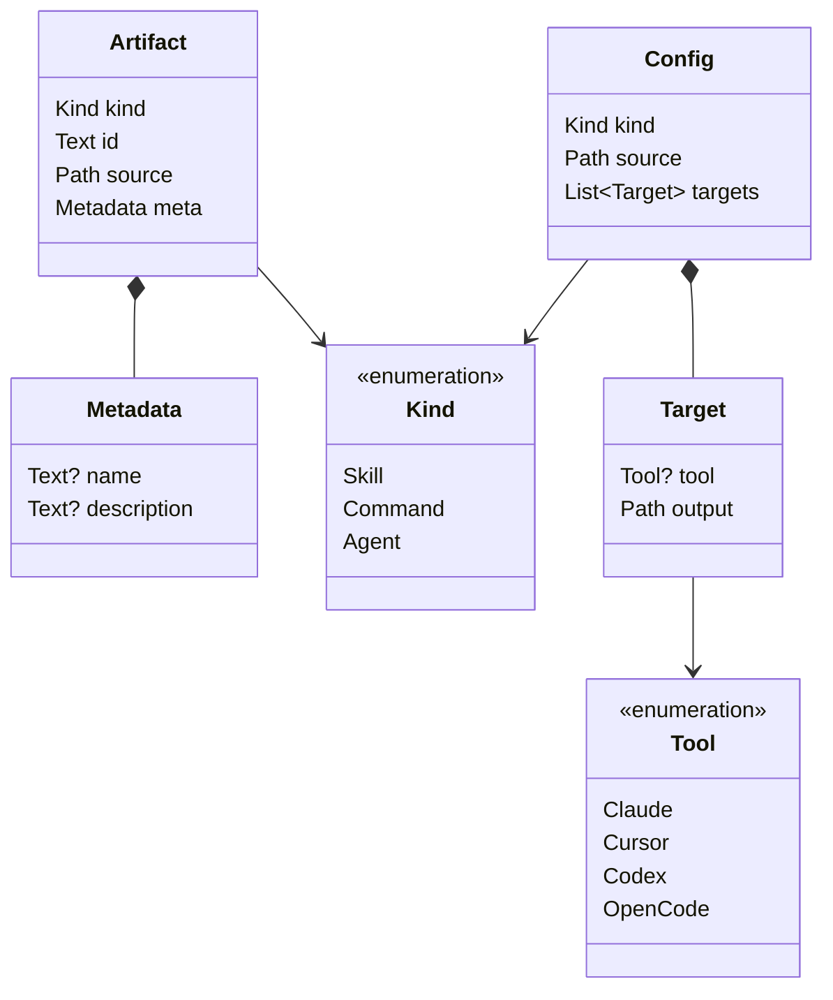

# Domain model

The business vocabulary of `atb`, defined once and independent of any language.
An **artifact** — a skill, a command, an agent — is authored once in a source
tree and distributed to the agent harnesses that consume it. Everything below is
a noun in that sentence.

The verb specs ([`atb sync`](atb-sync.md), [`atb sync --config`](config-spec.md),
[`atb scaffold`](atb-scaffold.md)) pin a Rust binding of these types in their
"Rust API" sections. This file is the conceptual source of truth, so a second
binding — a JSON schema, another language, a wire format — has one place to
agree with.

## Scope

Modeled here: the domain nouns and the rules intrinsic to them — fields,
constraints, identity, and the layout convention that gives an artifact its
identity on disk.

Not modeled here: **mechanics**. Execution plans, filesystem operations, command
input records, the discovery walk, validation ordering, and the CLI grammar are
how the tool works, not what the domain is. They live in the verb specs; see
[Deliberately not modeled](#deliberately-not-modeled) for the list and where
each one is defined.

## Normativity

One owner per fact:

- **Domain facts** — a model's fields, types, optionality, invariants, and the
  [layout convention](#layout-convention) — are normative **here**. The verb
  specs' Rust blocks are *informative bindings*: comment-free shape with one
  link up to this file. If a binding disagrees with a model, the binding is the
  bug.
- **Behavior facts** — what the pipelines do with these values, validation
  ordering, error handling, the CLI grammar — are normative in the **verb
  specs**; nothing here overrides them.
- **Surface defaults** — what an omitted flag or YAML field means — belong to
  the spec that owns that surface ([sync CLI](atb-sync.md#cli),
  [YAML schema](config-spec.md#schema), [scaffold CLI](atb-scaffold.md#cli)). A
  default is a construction rule of an input surface, not a property of a value.

When a field changes, it changes here first and the bindings follow.

## Notation

| Notation | Meaning |
|---|---|
| `Text` | Unicode string. |
| `Path` | A filesystem path. v1 is Unix-only — see each verb spec's *Platform* section. |
| `Name?` | **Optional**: the field may be absent in a value at rest. |
| `List<Name>` | Ordered sequence. |
| `A \| B \| C` | A **closed enumeration** — a value is exactly one of the listed variants. |
| `PascalCase` | A reference to another model in this file. |

Records list their fields as **Field · Type · Required · Notes**. *Required: no*
means one thing only — the field may be absent in a value at rest. A field an
input surface may omit but that every constructed value carries, such as
`Config.kind`, is `yes` here, with the omission rule owned by the surface spec.

## The picture

Two flows run over these nouns, both built from the shared `Kind` / `Tool`
vocabulary and the [layout convention](#layout-convention):

- **distribution** ([`atb sync`](atb-sync.md)) — a `Config` drives discovery
  into `Artifact`s, which are written under each `Target`'s `output`.
- **authoring** ([`atb scaffold`](atb-scaffold.md)) — a new artifact skeleton is
  written into the source tree such that a later discovery reads it back as an
  `Artifact`, per the [round-trip law](#the-round-trip-law).

## `Artifact`

One capability found in the source tree — the entity the whole tool exists to
move around.

| Field | Type | Required | Notes |
|---|---|---|---|
| `kind` | [`Kind`](#kind) | yes | Which category this is; selects the [layout convention](#layout-convention) column that shaped the rest. |
| `id` | `Text` | yes | The destination name under a target's `output`. **Derived** — see [Identity](#identity). |
| `source` | `Path` | yes | Where the artifact's content lives — the [`source` referent](#layout-convention): the skill directory, or the command/agent file. |
| `meta` | [`Metadata`](#metadata) | yes | Frontmatter-derived name and description. The record is always present; its fields may be empty. |

### Identity

- **`id` is derived, not free-standing.** `id` is a function of
  (`kind`, `source`) — the [id-from-`source` rule](#layout-convention): the
  skill directory's name, or the command/agent filename including its
  extension. A binding stores it for convenience, but it carries no information
  beyond `kind` + `source`.
- **`id` is unique within a discovered set.** The *discovered set* is the
  `List<Artifact>` one discovery run produces for a single (`source` root,
  `Kind`) pair. Within it, `id` is unique: two artifacts with the same `id`
  would resolve to the same destination path, so a collision is a hard error at
  discovery time, not a last-write-wins merge.
- **Identity is per-`Kind`.** A skill and a command may share a name without
  conflict — they are never in the same discovered set.
- **A name is machine-safe by construction.** An artifact's stem matches
  `^[a-z0-9]([a-z0-9-]*[a-z0-9])?$` and is at most 64 characters. This is the
  strictest of the four harnesses' naming rules, so a name that passes is legal
  on every `Tool`, filesystem-safe, and needs no YAML quoting. It is the stem
  only: the `.md` extension of a command or agent `id` is appended by the
  layout convention, so `critique.md` is an invalid *name* and a valid *`id`*.
  Authoring enforces the rule
  ([scaffold validation](atb-scaffold.md#validation)); discovery does not
  re-check the ids it finds, so a hand-written artifact may carry an id outside
  it.

### `Metadata`

Descriptive metadata lifted from the artifact's frontmatter — the first `---` /
`---` block of its [primary file](#layout-convention) (`SKILL.md` for a skill,
the file itself for a command or agent). A value object with no identity of its
own; the Rust binding names it `ArtifactMeta`.

| Field | Type | Required | Notes |
|---|---|---|---|
| `name` | `Text?` | no | The `name:` frontmatter value, if present. |
| `description` | `Text?` | no | The `description:` frontmatter value, if present. |

Both fields are best-effort: **missing or malformed frontmatter is not an
error** — the corresponding field stays empty. No other frontmatter key is read.

## `Kind`

Which **category of capability** an artifact is. `Kind` is the primary axis of
the domain: it decides how discovery finds an artifact, how its `id` and
`source` are derived, and where a new one is written — all of it the
[layout convention](#layout-convention).

| Variant | String form | Meaning |
|---|---|---|
| `Skill` | `skill` | A directory of instructions plus supporting files, marked by a `SKILL.md`. |
| `Command` | `command` | A single-file slash command. |
| `Agent` | `agent` | A single-file agent definition. |

Every input surface that selects a `Kind` — sync's `--kind`, the YAML `kind:`
field, scaffold's `--kind` — defaults an omitted value to `skill`. Each surface
spec owns its default ([sync CLI](atb-sync.md#cli),
[YAML schema](config-spec.md#schema), [scaffold CLI](atb-scaffold.md#cli)); the
models carry no defaults.

## `Tool`

Which **agent harness** a capability is destined for — a destination CLI or app
whose config directories hold skills, commands, and agents.

| Variant | String form | Meaning |
|---|---|---|
| `Claude` | `claude` | Anthropic's Claude Code / Claude apps. |
| `Cursor` | `cursor` | Cursor editor. |
| `Codex` | `codex` | OpenAI Codex CLI. |
| `OpenCode` | `opencode` | OpenCode. |

The **string form** is the identity used outside the program: it is the
`targets.<tool>` key in the YAML config and the `--tool` flag value. The set is
closed — any other string is an error, not a new tool.

In v1 all four harnesses share one copy layout, so a `Target`'s `tool` is
carried but not read by distribution; authoring reads it to pick a template
flavor, and only `Claude` has a template set
([`--tool`](atb-scaffold.md#--tool)).

Both enumerations are small and deliberately fixed: adding a variant ripples
into discovery, layout, templates, and the CLI, so it is a design change rather
than a configuration one.

## `Config`

One distribution job: a single `Kind` discovered under one `source`, fanned out
to one or more `Target`s. The name is the binding's — a `Config` is what both
input surfaces construct — but the concept is the domain relation *this kind of
artifact, from here, goes there*.

| Field | Type | Required | Notes |
|---|---|---|---|
| `kind` | [`Kind`](#kind) | yes | The one category this job distributes. Every constructed `Config` carries one; both surfaces default an omitted kind to `skill`. |
| `source` | `Path` | yes | Root of the tree discovery walks. |
| `targets` | `List<`[`Target`](#target)`>` | yes | Where to write. **Non-empty** — see [Invariants](#invariants). |

### `Target`

One destination of a distribution: a directory some `Tool` reads capabilities
from.

| Field | Type | Required | Notes |
|---|---|---|---|
| `tool` | [`Tool`](#tool)`?` | no | The harness this destination is for. Empty only on the flag path — see [Invariants](#invariants). |
| `output` | `Path` | yes | Directory artifacts are written under. From `--dst`, or `targets.<tool>.output`. |

### Invariants

- **`targets` is non-empty.** A config with no targets is an error
  ([config-spec](config-spec.md#validation)).
- **One `Kind` per `Config`.** A job distributes exactly one category. Syncing
  skills and commands is two jobs, not one config with a `kinds:` list —
  multi-kind routing is explicitly out of scope
  ([config-spec](config-spec.md#out-of-scope)).
- **`tool` labeling is coherent.** Within one `Config`, exactly two
  configurations occur: **every** target carries a `tool` (the YAML path — each
  `targets.<tool>` key labels its entry), or `targets` is a **single** element
  whose `tool` is empty (the flag path — the flags have no place to name a
  tool). A mixed list, or a multi-target list with unlabeled entries, is never
  constructed and has no defined meaning. This is the reason `tool` is optional
  at all: the optionality encodes the flag path's missing label, not a
  per-target free choice.

## Layout convention

How each [`Kind`](#kind) meets the filesystem. This is a **static rule**, not a
runtime value: exactly one column per variant, fixed at design time, with no
type in any binding. It belongs here rather than in a verb spec because it is
what makes an artifact identifiable at all — [`Artifact`](#artifact) identity,
the [round-trip law](#the-round-trip-law), and both verbs' filesystem behavior
are projections of it.

| | `Skill` | `Command` | `Agent` |
|---|---|---|---|
| **Marker** — what discovery matches | `**/skills/*/SKILL.md` | `**/commands/*.md`, direct children only | `**/agents/*.md`, direct children only |
| **`source` referent** | the skill directory | the matched file | the matched file |
| **`id` from `source`** | the directory name | the filename, extension included | the filename, extension included |
| **Primary file** — where frontmatter is read | `{source}/SKILL.md` | `source` itself | `source` itself |
| **Scaffold path** — where a new one is written | `{dir}/skills/{name}/SKILL.md` | `{dir}/commands/{name}.md` | `{dir}/agents/{name}.md` |
| **`id` from `name`** | `{name}` | `{name}.md` | `{name}.md` |

The two `id` rows agree by construction: scaffolding `name` at the scaffold path
and then discovering yields exactly the `id` the name row predicts. That
agreement is the mechanical core of the [round-trip law](#the-round-trip-law).

Behavior around the convention — symlink following, the nested-`SKILL.md` error,
what happens to a file in `commands/foo/bar.md`, how a skill directory is copied
out — belongs to the verb specs ([discovery](atb-sync.md#discovery),
[copy semantics](atb-sync.md#copy-semantics),
[templates](atb-scaffold.md#layout-and-templates)).

## The round-trip law

Authoring and distribution meet at one law, the system's central invariant. For
an artifact [scaffolded](atb-scaffold.md#behavior) under `dir` with a given
`kind` and stem `name`, immediately after the scaffold succeeds
`discover(dir, kind)` succeeds, and exactly one artifact `a` in its result is
new, with:

- `a.kind` = the scaffolded `kind`;
- `a.id` = the [id-from-`name` rule](#layout-convention) — `{name}` for `Skill`,
  `{name}.md` for `Command` / `Agent`;
- `a.source` = the [`source` referent](#layout-convention) of the written path;
- `a.meta.description` populated — the given description when there is one, the
  per-kind placeholder otherwise;
- `a.meta.name` = `name` for the kinds whose template writes `name:`
  frontmatter (`Skill`, `Agent`); the `Command` template carries only
  `description:`, so a command's `meta.name` stays empty.

**Proviso.** The law assumes `name` does not collide with the `id` of a
same-`Kind` artifact already elsewhere under `dir`. Scaffold's collision check
is path-local (its exact destination), while discovery's uniqueness check spans
the whole tree — so a same-`id` artifact under a different subtree makes the
subsequent `discover` fail with a duplicate-`id` error rather than include the
new artifact.

This statement is canonical; [atb-scaffold](atb-scaffold.md#behavior) restates
it informally.

## Deliberately not modeled

These are named in the verb specs and are real types in the binding. They are
mechanics or command inputs rather than domain nouns, so they have no entry
here:

| Name | What it actually is | Defined in |
|---|---|---|
| `FileOp` | A filesystem operation (`Copy { from, to }`) — the mechanism distribution runs on, not a thing the domain talks about. | [atb-sync](atb-sync.md#rust-api), postcondition in [Apply](atb-sync.md#apply) |
| `SyncPlan` | An execution plan: the `FileOp`s computed for one `Target`, printed before they run. Derived from a `Config`, owning nothing. | [atb-sync](atb-sync.md#rust-api) |
| `ScaffoldSpec` | The input record of the `scaffold` operation — the CLI's flags with a name. Its one domain fact, the stem rule, is an [`Artifact` identity](#identity) invariant. | [atb-scaffold](atb-scaffold.md#rust-api) |
| `Adapter` / `CopyAdapter` | A strategy turning `Artifact`s plus a `Target` into `FileOp`s. It produces data; it is not data. | [atb-sync](atb-sync.md#rust-api) |
| `discover` / `plan` / `apply` / `scaffold` | The pipeline functions. | [atb-sync](atb-sync.md#rust-api), [atb-scaffold](atb-scaffold.md#rust-api) |
