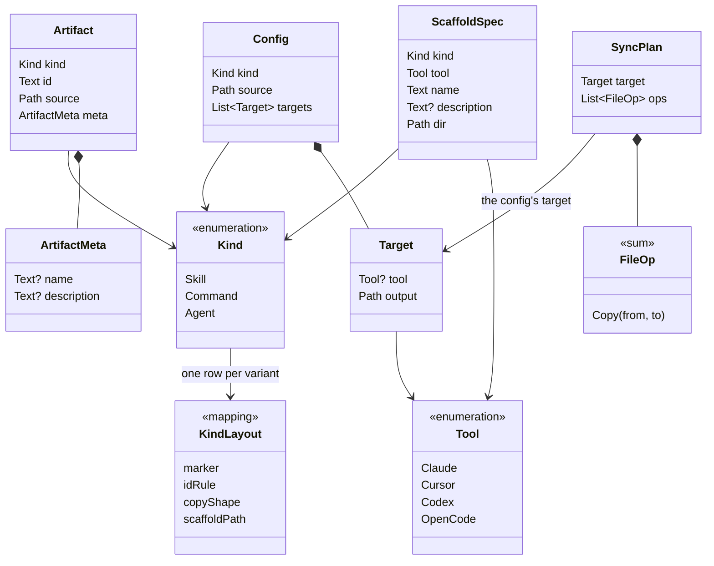

# Domain models

Language-agnostic definitions of the data that flows through `atb`. The verb
specs — [`atb sync`](../atb-sync.md), [`atb sync --config`](../config-spec.md),
[`atb scaffold`](../atb-scaffold.md) — each pin a Rust binding of these types in
their "Rust API" sections. This folder is the conceptual source of truth: it
describes *what the data is* independent of any one language, so a second
binding (a JSON schema, a Python port, a wire format) has one place to agree
with.

## Scope: data, not behavior

A **domain data model** here is a value the tool passes around — a record, an
enumeration, or a tagged union — plus one static mapping
([`KindLayout`](kind-layout.md)) those values are shaped by. This folder
defines their shapes, field constraints, and the relationships and identity
rules intrinsic to the data.

It deliberately does **not** define behavior. Discovery walking, copy planning,
apply, frontmatter parsing, validation *ordering*, and the CLI grammar are
processes, not data; they live in the verb specs. Named operations that are not
data models — the `Adapter` / `CopyAdapter` strategy and the `discover` /
`plan` / `apply` / `scaffold` functions — are called out under
[Not modeled here](#not-modeled-here).

## Normativity

Ownership of facts is split, one owner per fact:

- **Data facts** — a model's fields, types, optionality, invariants, and the
  [`KindLayout`](kind-layout.md) mapping — are normative **here**. The verb
  specs' Rust blocks are *informative bindings*: deliberately comment-free
  shape with one link up to this folder. If a binding disagrees with a model,
  the binding is the bug.
- **Behavior facts** — what the pipelines do with these values, validation
  ordering, error handling, the CLI grammar — are normative in the **verb
  specs**; nothing here overrides them.
- **Surface defaults** — what an omitted flag or YAML field means — belong to
  the spec that owns that surface ([sync CLI](../atb-sync.md#cli),
  [YAML schema](../config-spec.md#schema),
  [scaffold CLI](../atb-scaffold.md#cli)), not to the models: a default is a
  construction rule of an input surface, not a property of the value.

When a field changes, it changes here first and the bindings follow.

## Notation

Models are written with an abstract type vocabulary, not any language's syntax:

| Notation | Meaning |
|---|---|
| `Text` | Unicode string. |
| `Path` | A filesystem path. v1 is Unix-only — see each verb spec's *Platform* section. |
| `Bool` | `true` / `false`. |
| `Name?` | **Optional**: the field may be absent / unset. |
| `List<Name>` | Ordered sequence, possibly empty unless a constraint says otherwise. |
| `A \| B \| C` | A **closed enumeration** — a value is exactly one of the listed variants. |
| `PascalCase` | A reference to another model in this folder (e.g. `Target`). |
| «sum» | A **tagged union**: a value is exactly one of the listed variants, each carrying its own fields. |

Each record lists its fields as **Field · Type · Required · Notes**. *Required*
is `yes` / `no`, and `no` means exactly one thing: the field may be **absent in
a value at rest** (it is `?`-typed). A field an input surface may omit but that
every constructed value carries — `Config.kind`, say — is `yes` here, with the
omission rule documented by the surface spec that owns it (see
[Normativity](#normativity)). Each model file carries an **Invariants**
section: the constraints a value must satisfy, stated over the data.

## Model catalog

| Model | File | In one line | Referenced by |
|---|---|---|---|
| [`Tool`](enumerations.md#tool) | [enumerations.md](enumerations.md) | Which agent harness a capability is destined for. | sync, config, scaffold |
| [`Kind`](enumerations.md#kind) | [enumerations.md](enumerations.md) | Which category of capability: skill, command, or agent. | sync, config, scaffold |
| [`KindLayout`](kind-layout.md#the-mapping) | [kind-layout.md](kind-layout.md) | The static per-`Kind` layout rule every other layout fact projects from. | sync, scaffold |
| [`Artifact`](artifact.md#artifact) | [artifact.md](artifact.md) | One discovered capability in the source tree. | sync |
| [`ArtifactMeta`](artifact.md#artifactmeta) | [artifact.md](artifact.md) | Optional `name` / `description` read from frontmatter. | sync, scaffold |
| [`Config`](config.md#config) | [config.md](config.md) | One sync job: a `Kind`, a `source`, and its `Target`s. | sync, config |
| [`Target`](config.md#target) | [config.md](config.md) | One output destination, optionally labeled by `Tool`. | sync, config |
| [`FileOp`](sync-plan.md#fileop) | [sync-plan.md](sync-plan.md) | A single filesystem operation; v1 is `Copy` only. | sync |
| [`SyncPlan`](sync-plan.md#syncplan) | [sync-plan.md](sync-plan.md) | The `FileOp`s computed for one `Target`. | sync |
| [`ScaffoldSpec`](scaffold-spec.md#scaffoldspec) | [scaffold-spec.md](scaffold-spec.md) | The inputs to create one new artifact skeleton. | scaffold |

## Relationships

`SyncPlan → Target` is a reference, not a composition: a plan's `target` *is*
one of the config's targets (see [sync-plan invariants](sync-plan.md#invariants)),
so `Config` remains the only owner.

Two pipelines consume these models, both built from the shared `Tool` / `Kind`
vocabulary and the [`KindLayout`](kind-layout.md) mapping:

- **sync** — `Config` (one per `Kind`) drives discovery into `Artifact`s; each
  `Target` is planned into a `SyncPlan` whose `ops` are the `FileOp`s `apply`
  executes to write files under `Target.output`.
- **scaffold** — a `ScaffoldSpec` writes one new artifact skeleton into the
  source tree such that a subsequent sync discovers it as an `Artifact` — the
  [round-trip law](#the-round-trip-law) below.

## The round-trip law

The two pipelines agree on one law, the system's central invariant. For a
`ScaffoldSpec` `s` that scaffold accepts, immediately after `scaffold(s)`
succeeds:

`discover(s.dir, s.kind)` succeeds, and exactly one artifact `a` in its result
is new, with:

- `a.kind = s.kind`;
- `a.id` = the [`KindLayout` id rule](kind-layout.md#the-id-derivation) applied
  to `s.name` — `{name}` for `Skill`, `{name}.md` for `Command` / `Agent`;
- `a.source` = the [`KindLayout` referent](kind-layout.md#the-mapping) of the
  scaffolded path;
- `a.meta.description` populated — `s.description` when given, the per-kind
  placeholder otherwise;
- `a.meta.name = s.name` for the kinds whose template writes `name:`
  frontmatter (`Skill`, `Agent`); the `Command` template carries only
  `description:`, so a command's `meta.name` stays empty.

**Proviso.** The law assumes `s.name` does not collide with the `id` of a
same-`Kind` artifact already elsewhere under `s.dir`. Scaffold's collision
check is path-local (its exact destination), while discovery's uniqueness
check spans the whole tree — so a same-`id` artifact under a different subtree
makes the subsequent `discover` fail with a duplicate-`id` error rather than
include the new artifact.

Statements of this law elsewhere
([atb-scaffold](../atb-scaffold.md#behavior), the
[artifact.md round-trip note](artifact.md#artifactmeta)) are informal
restatements; this one is canonical.

## Not modeled here

These are named in the verb specs but are **behavior**, not data models, so they
are out of scope for this folder:

- **`Adapter` / `CopyAdapter`** — a strategy that turns `Artifact`s + a `Target`
  into `FileOp`s. It produces data (`FileOp`s) but is itself an operation. See
  [atb-sync](../atb-sync.md#rust-api).
- **`discover` / `plan` / `apply`** — the sync pipeline functions. See
  [atb-sync](../atb-sync.md#rust-api).
- **`scaffold`** — the function that renders and writes a `ScaffoldSpec`. See
  [atb-scaffold](../atb-scaffold.md#rust-api).
