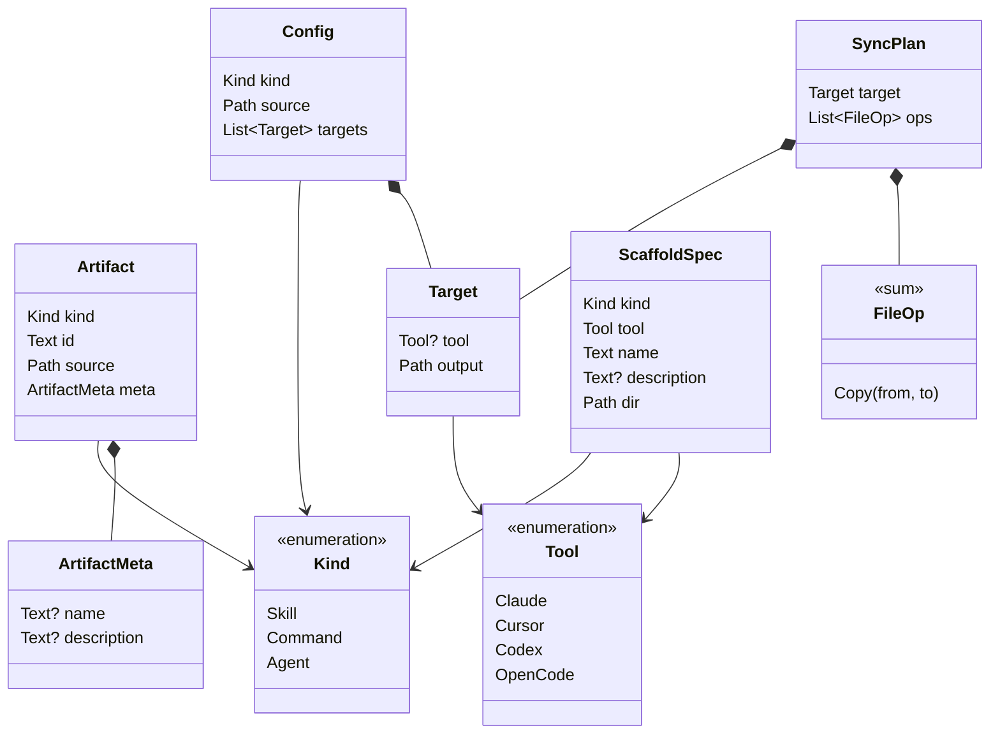

# Domain models

Language-agnostic definitions of the data that flows through `atb`. The verb
specs — [`atb sync`](../atb-sync.md), [`atb sync --config`](../config-spec.md),
[`atb scaffold`](../atb-scaffold.md) — each pin a Rust binding of these types in
their "Rust API" sections. This folder is the conceptual source of truth: it
describes *what the data is* independent of any one language, so a second
binding (a JSON schema, a Python port, a wire format) has one place to agree
with. When a field changes, it changes here first and the bindings follow.

## Scope: data, not behavior

A **domain data model** here is a value the tool passes around — a record, an
enumeration, or a tagged union. This folder defines their shapes, field
constraints, and the relationships and identity rules intrinsic to the data.

It deliberately does **not** define behavior. Discovery walking, copy planning,
apply, frontmatter parsing, validation *ordering*, and the CLI grammar are
processes, not data; they live in the verb specs. Named operations that are not
data models — the `Adapter` / `CopyAdapter` strategy and the `discover` /
`plan` / `apply` / `scaffold` functions — are called out under
[Not modeled here](#not-modeled-here).

## Notation

Models are written with an abstract type vocabulary, not any language's syntax:

| Notation | Meaning |
|---|---|
| `Text` | Unicode string. |
| `Path` | A filesystem path. v1 is Unix-only — see each verb spec's *Platform* section. |
| `Bool` | `true` / `false`. |
| `Name?` | **Optional**: the field may be absent / unset. |
| `List<Name>` | Ordered sequence, possibly empty unless a constraint says otherwise. |
| `A \| B \| C` | A **closed enumeration** — a value is exactly one of the listed variants. |
| `PascalCase` | A reference to another model in this folder (e.g. `Target`). |
| «sum» | A **tagged union**: a value is exactly one of the listed variants, each carrying its own fields. |

Each record lists its fields as **Field · Type · Required · Notes**, where
*Required* is `yes` / `no` and a `no` field is either `Name?`-typed or carries a
default (shown as `default: …`).

## Model catalog

| Model | File | In one line | Referenced by |
|---|---|---|---|
| [`Tool`](enumerations.md#tool) | [enumerations.md](enumerations.md) | Which agent harness a capability is destined for. | sync, config, scaffold |
| [`Kind`](enumerations.md#kind) | [enumerations.md](enumerations.md) | Which category of capability: skill, command, or agent. | sync, config, scaffold |
| [`Artifact`](artifact.md#artifact) | [artifact.md](artifact.md) | One discovered capability in the source tree. | sync |
| [`ArtifactMeta`](artifact.md#artifactmeta) | [artifact.md](artifact.md) | Optional `name` / `description` read from frontmatter. | sync, scaffold |
| [`Config`](config.md#config) | [config.md](config.md) | One sync job: a `Kind`, a `source`, and its `Target`s. | sync, config |
| [`Target`](config.md#target) | [config.md](config.md) | One output destination, optionally labeled by `Tool`. | sync, config |
| [`FileOp`](sync-plan.md#fileop) | [sync-plan.md](sync-plan.md) | A single filesystem operation; v1 is `Copy` only. | sync |
| [`SyncPlan`](sync-plan.md#syncplan) | [sync-plan.md](sync-plan.md) | The `FileOp`s computed for one `Target`. | sync |
| [`ScaffoldSpec`](scaffold-spec.md#scaffoldspec) | [scaffold-spec.md](scaffold-spec.md) | The inputs to create one new artifact skeleton. | scaffold |

## Relationships

Two pipelines consume these models, both built from the shared `Tool` / `Kind`
vocabulary:

- **sync** — `Config` (one per `Kind`) drives discovery into `Artifact`s; each
  `Target` is planned into a `SyncPlan` whose `ops` are `FileOp`s that apply
  writes files under `Target.output`.
- **scaffold** — a `ScaffoldSpec` writes one new artifact skeleton into the
  source tree such that a subsequent sync discovers it as an `Artifact` with its
  `ArtifactMeta` populated (the round-trip invariant).

## Not modeled here

These are named in the verb specs but are **behavior**, not data models, so they
are out of scope for this folder:

- **`Adapter` / `CopyAdapter`** — a strategy that turns `Artifact`s + a `Target`
  into `FileOp`s. It produces data (`FileOp`s) but is itself an operation. See
  [atb-sync](../atb-sync.md#rust-api).
- **`discover` / `plan` / `apply`** — the sync pipeline functions. See
  [atb-sync](../atb-sync.md#rust-api).
- **`scaffold`** — the function that renders and writes a `ScaffoldSpec`. See
  [atb-scaffold](../atb-scaffold.md#rust-api).
